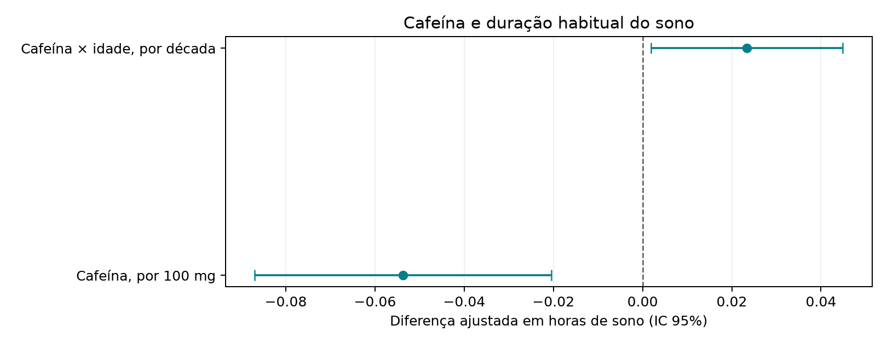
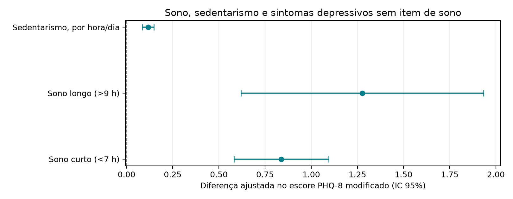
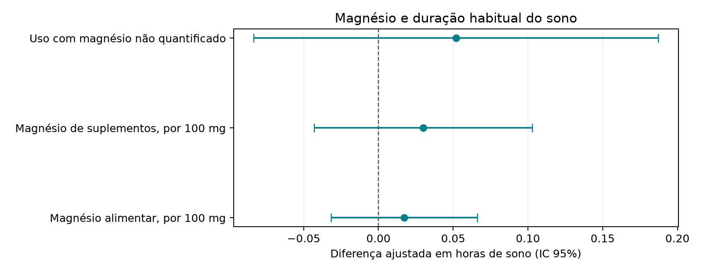
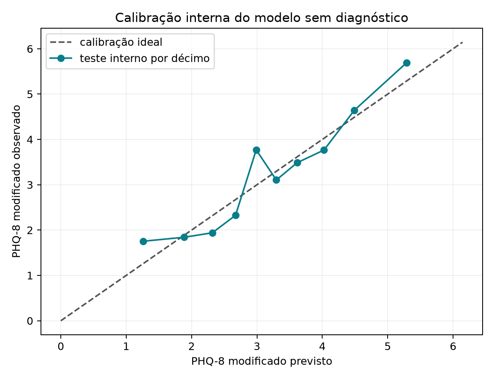

# Resultados do ciclo

<!-- discovery-cycles:start -->
## Cafeína, sono, sedentarismo, magnésio e predição diagnóstico-agnóstica

Primeiro ciclo exploratório com adultos da NHANES 2021–2023. Testa três famílias de hipóteses registradas e um modelo Ridge que prevê PHQ-8 sem usar rótulos diagnósticos.

População: Adultos de 20–80 anos com dados completos nos módulos NHANES utilizados; grupos de superdotação, autismo e TDAH não foram identificados nesta rodada.

### A cafeína do recordatório alimentar se associa a sono usual mais curto?

-0,0537 hora por 100 mg
IC95% -0,0869 a -0,0205; p-FDR=0,0072
n=4.211; WLS com pesos de dieta e variância por estratos/PSUs

Sinal compatível com menor duração de sono, mas transversal e não causal; a sensibilidade excluindo >800 mg enfraqueceu a interação com idade.

### Sono curto/longo e sedentarismo se associam a sintomas depressivos sem reutilizar o item de sono?

Sono curto +0,838 PHQ-8; sono longo +1,276; sedentarismo +0,1165 por hora
IC95% curto +0,582 a +1,094; longo +0,619 a +1,934; sedentarismo +0,0854 a +0,1476; p-FDR <0,003
n=4.522; PHQ-8 excluindo DPQ030; WLS com pesos de exame

Associações robustas na amostra, compatíveis com hipóteses de sono/atividade, mas também com causalidade reversa e confusão por saúde.

### Magnésio alimentar ou suplementar se associa à duração do sono?

+0,0173 hora por 100 mg dietético; +0,0300 por 100 mg suplementar
IC95% dietético -0,0317 a +0,0662; suplementar -0,0429 a +0,1029; p-FDR=0,4634
n=4.194; suplemento não quantificado modelado separadamente; WLS com peso de dieta

Evidência inconclusiva; o intervalo inclui efeitos pequenos em ambas as direções e não sustenta protocolo de suplementação.

### É possível prever PHQ-8 sem conhecer o diagnóstico?

Ridge: MAE 2,903; RMSE 3,945; R² 0,090
Holdout interno único: n treino=3.391, teste=1.131; sem validação externa/temporal
n=4.522; sono, sedentarismo e contexto demográfico; pesos usados no ajuste/métricas

Prova de conceito de previsão dimensional modesta; contexto demográfico contribuiu mais que os domínios isolados nas ablações.



H1: estimativas e IC95% para cafeína e interação com idade.



H2: categorias de sono e horas sedentárias associadas ao PHQ-8 sem o item de sono.



H3: magnésio alimentar, suplementar e dose suplementar não quantificada.



Predição diagnóstico-agnóstica no holdout interno e ablações por domínio.

## Limitações

- NHANES é transversal neste recorte; associações não estabelecem causalidade.
- A rodada não mede nem estratifica altas habilidades, autismo ou TDAH.
- Recordatórios, autorrelato e suplementação têm erro de mensuração.
- O preditor tem uma única separação interna e não foi calibrado externamente.
- Resultados não são recomendação individual de dieta, suplemento, exercício ou sono.

## Fontes

- [CDC NHANES 2021–2023 codebooks and weighting guidance](https://wwwn.cdc.gov/nchs/nhanes/tutorials/weighting.aspx)
- [Gardiner et al. 2023 caffeine and sleep meta-analysis](https://pubmed.ncbi.nlm.nih.gov/36870101/)
- [Longitudinal sleep and depression study](https://pubmed.ncbi.nlm.nih.gov/29861378/)
- [Maastricht Study activity and depression evidence](https://pubmed.ncbi.nlm.nih.gov/36114702/)
- [Magnesium bisglycinate randomized trial](https://pubmed.ncbi.nlm.nih.gov/40918053/)

## Reprodução

```json
{
  "command": "MPLCONFIGDIR=/tmp/science-matplotlib PIPENV_VENV_IN_PROJECT=1 pipenv run python research/discoveries/cycle-001/run_analysis.py",
  "code_revision": "working-tree; see run_analysis.py and hypotheses.yaml",
  "input_sha256": {
    "DEMO_L.xpt": "ca4374a158b493b8b0163e1388da21d57a18d1b9cecff2aa4e2fa2bec494fe23",
    "DPQ_L.xpt": "25605a02685035fe997477b31a0991cca2776b0f72f24a8e61ac5b018456304b",
    "DR1TOT_L.xpt": "73a3097aab64000f9c1d138367363ca605968b691e349981132bd6032ca6c9ef",
    "DSQTOT_L.xpt": "8ee3e55578f56918a190100bb321a0b580f824ca3cc439901f2fd707dbe695f8",
    "PAQ_L.xpt": "de34acfed4523f10f52bea06e64ed33c8db973cb38d3539eeceb2b68039248c8",
    "SLQ_L.xpt": "918c3258b2f466ac1cae55ea45330c736dbdc573ee4dc72306e3d2b222764741"
  }
}
```
<!-- discovery-cycles:end -->
