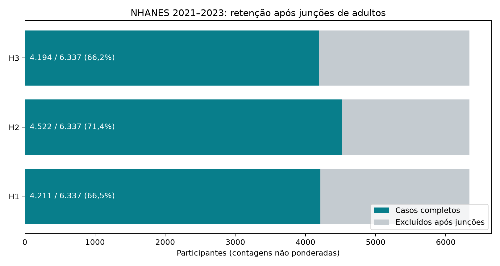
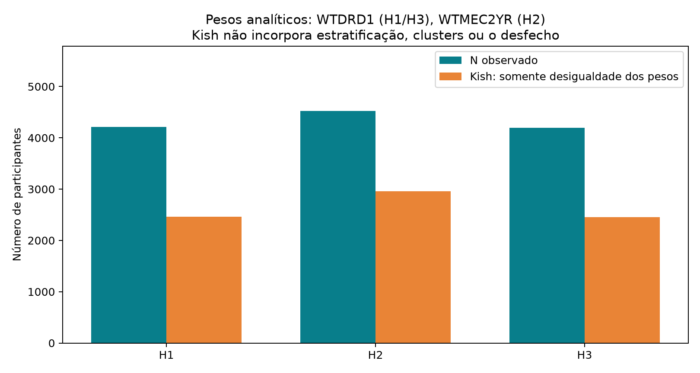

# Resultados do ciclo

<!-- discovery-cycles:start -->
## Auditoria de perdas, pesos e variância do ciclo 001

Reconstituição das amostras e comparação Taylor com svy: erros-padrão reproduzidos e perdas após junções. Os ciclos 003–004 registram atualizações posteriores de mensuração e inferência.

População: NHANES 2021–2023: 6.337 adultos após junções por hipótese, 4.194–4.522 casos completos de 20–80 anos; HA/autismo/TDAH não avaliados.

> Auditoria de implementação e seleção, não replicação. Erros-padrão coincidem com svy; p-valores não coincidem por padrão porque as convenções de graus de liberdade diferem. Atualização posterior: os ciclos 003 e 004 trataram, respectivamente, a mensuração de magnésio e a convenção de inferência/seleção observável.

[Métodos, decisões e fontes no site](https://gmrodrigues.github.io/estudo-biohacking-neurodivergente-altas-habilidades/cycles/cycle-002/index.html)

[Registro editorial completo](public-dossier.json)

### Quanto se perde após as junções por hipótese?

H1: 4.211/6.337 (66,45%); H2: 4.522/6.337 (71,36%); H3: 4.194/6.337 (66,18%)
Contagens exatas dos arquivos locais; não são estimativas de prevalência e não requerem IC.
6.337 adultos após junções; antes delas, DEMO contém 8.153 adultos.

273 pessoas de 18–19 anos não têm a escolaridade 20+ exigida. Ausência de renda, dieta e sintomas explica outras perdas observáveis, com sobreposição.

### Qual é a concentração dos pesos analíticos?

Kish: H1=2.460,2; H2=2.957,1; H3=2.450,7
Indicadores descritivos dos pesos; não são N efetivos completos do desenho.
WTDRD1 em H1/H3; WTMEC2YR em H2; sem truncamento de pesos.

O 1% de maiores pesos concentra aproximadamente 4,4–5,4% da soma; seleção por casos completos permanece uma limitação.

### A implementação anterior reproduz a variância de um pacote independente?

Diferença relativa máxima nos erros-padrão <2×10⁻¹³; coeficientes diferem <6×10⁻¹³
Concordância numérica por coeficiente; não é IC de efeito nem validação causal.
svy 0.28.0, domínio de casos completos no desenho completo; 15 estratos/30 PSUs representados em cada modelo.

Coeficientes e erros-padrão conferidos neste domínio; a rotina anterior não deve ser generalizada a domínios com PSUs vazias.

### Os testes dependem da convenção de graus de liberdade?

15 graus no ciclo 001; 1 no padrão svy. Com o padrão svy, nenhum dos oito q-valores é <0,05.
Mesmos coeficientes e erros-padrão; distribuições t diferentes. Com 15 graus, svy reproduz os p/q originais.
17 coeficientes em H1/H2 e 18 em H3; svy aplica max(1, 15−(k−1)).

Relatar as duas convenções. O piso de 1 não prova superioridade; definir complexidade e inferência antes de novas análises.



NHANES 2021–2023: contagens não ponderadas após junções de adultos; não representa taxa populacional de resposta.



WTDRD1 para H1/H3, WTMEC2YR para H2; Kish reflete somente desigualdade dos pesos, sem IC ou correção por clusters.

## Limitações

- Auditoria na mesma onda e nos mesmos participantes, sem replicação independente.
- Inferência sensível à convenção de graus; modelos têm 17–18 coeficientes para 15 graus do desenho.
- Casos completos podem introduzir seleção não resolvida pelos pesos originais.
- DSQTMAGN ausente não identifica por si só consumo de magnésio com dose desconhecida.
- Não identifica altas habilidades, autismo ou TDAH; não orienta dose individual.

## Fontes

- [CDC: variância e subpopulações NHANES](https://wwwn.cdc.gov/nchs/nhanes/tutorials/varianceestimation.aspx)
- [CDC: ponderação NHANES](https://wwwn.cdc.gov/nchs/nhanes/tutorials/weighting.aspx)
- [DEMO_L: escolaridade de adultos 20+](https://wwwn.cdc.gov/Nchs/Data/Nhanes/Public/2021/DataFiles/DEMO_L.htm)
- [DSQTOT_L: suplementos e antiácidos](https://wwwn.cdc.gov/Nchs/Data/Nhanes/Public/2021/DataFiles/DSQTOT_L.htm)
- [svy: regressão e análise de domínio](https://svylab.com/docs/svy/tutorials/glm.html)
- [R survey: convenções de graus de liberdade](https://r-survey.r-forge.r-project.org/pkgdown/docs/reference/svyglm.html)

## Reprodução

```json
{
  "command": "MPLCONFIGDIR=/tmp/science-matplotlib PIPENV_VENV_IN_PROJECT=1 pipenv run python research/discoveries/cycle-002/run_audit.py",
  "code_revision": "working tree; run_audit.py sha256=f190c0e3a52d60fe23e7e398bcf3dd8e81e06ee540b4425fe0ee5a566f9d2aef; svy 0.28.0; additional hashes in results.json",
  "input_sha256": {
    "DEMO_L.xpt": "ca4374a158b493b8b0163e1388da21d57a18d1b9cecff2aa4e2fa2bec494fe23",
    "DPQ_L.xpt": "25605a02685035fe997477b31a0991cca2776b0f72f24a8e61ac5b018456304b",
    "DR1TOT_L.xpt": "73a3097aab64000f9c1d138367363ca605968b691e349981132bd6032ca6c9ef",
    "DSQTOT_L.xpt": "8ee3e55578f56918a190100bb321a0b580f824ca3cc439901f2fd707dbe695f8",
    "PAQ_L.xpt": "de34acfed4523f10f52bea06e64ed33c8db973cb38d3539eeceb2b68039248c8",
    "SLQ_L.xpt": "918c3258b2f466ac1cae55ea45330c736dbdc573ee4dc72306e3d2b222764741"
  }
}
```
<!-- discovery-cycles:end -->
