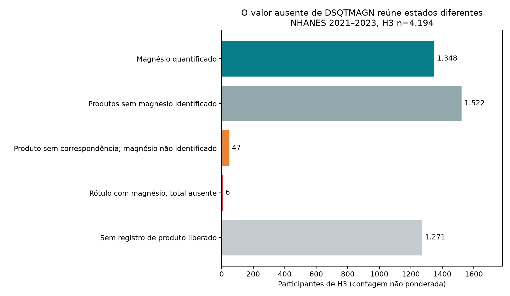

# Resultados do ciclo

<!-- discovery-cycles:start -->
## Magnésio por produto: o que a ausência em DSQTMAGN realmente significa

Auditoria de DSQIDS/DSPI/DSII mostra que o indicador legado de 1.401 usuários mistura produtos sem magnésio identificado com somente 6 casos de rótulo com magnésio e total ausente.

População: Amostra H3 do NHANES 2021–2023, n=4.194 adultos de 20–80 anos; auditoria de produtos e antiácidos, sem novo modelo de desfecho.

> Auditoria de mensuração posterior ao ciclo 001: o indicador legado de 1.401 pessoas não representa magnésio não quantificado. Somente 6 participantes têm produto rotulado com magnésio e total ausente. Os coeficientes anteriores são preservados, com interpretação corrigida.

[Métodos, decisões e fontes no site](https://gmrodrigues.github.io/estudo-biohacking-neurodivergente-altas-habilidades/cycles/cycle-003/index.html)

[Registro editorial completo](public-dossier.json)

### Quantos participantes marcados pelo indicador legado têm evidência de produto com magnésio?

6 de 1.401 têm produto rotulado com magnésio e DSQTMAGN ausente
Contagens exatas nos arquivos locais; classificação depende da correspondência pública de rótulos e não requer IC.
H3 n=4.194; DSQIDS_L ligado a DSPI/DSII por DSDPID.

O indicador legado não mede magnésio de dose desconhecida e precisa de nome descritivo.

### Por que participantes sem suplemento podem ter magnésio quantificado?

28 participantes com DSD010=2 e DSQTMAGN presente; todos possuem antiácido
Contagem não ponderada; não estima prevalência de uso de antiácidos.
H3 n=4.194; DSDANTA no nível produto.

DSQTMAGN soma suplementos e antiácidos, enquanto DSD010=2 pode significar ausência de suplemento com antiácido registrado separadamente.

### Os componentes individuais reproduzem o total?

1.613 de 1.613 totais ficam a ≤0,05 mg da soma DSQIMAGN × dias/30
Concordância aritmética na resolução divulgada; não é incerteza de ingestão.
Arquivo completo DSQIDS_L/DSQTOT_L, participantes com ambos os valores presentes.

A ligação e a frequência foram reproduzidas; autorrelato, rótulo e adesão permanecem fontes de erro.



H3, n=4.194, contagens não ponderadas. Estados derivados de DSQTOT_L, DSQIDS_L e rótulos DSPI/DSII; não representam prevalência populacional ou efeito no sono.

## Limitações

- Dados de rótulo não comprovam ingestão ou adesão.
- Nomes de ingredientes com magnésio não fornecem, sozinhos, a quantidade elementar.
- Nomes comerciais não são apropriados para prevalência e não são publicados aqui.
- Misturas foram inventariadas, sem inferir magnésio oculto.
- Mesmos participantes e onda do ciclo 001; sem novo modelo de desfecho ou replicação.
- DSQTMAGN ausente não foi imputado; quatro ocorrências rotuladas com magnésio permanecem sem quantidade individual.
- A auditoria não ajusta novo modelo e não altera resultados numéricos de H3.

## Fontes

- [CDC DSQIDS_L: produtos, antiácidos, cálculo e cautelas](https://wwwn.cdc.gov/Nchs/Data/Nhanes/Public/2021/DataFiles/DSQIDS_L.htm)
- [CDC DSQTOT_L: totais de suplementos e antiácidos](https://wwwn.cdc.gov/Nchs/Data/Nhanes/Public/2021/DataFiles/DSQTOT_L.htm)
- [CDC NHANES-DSD: informações dos produtos (DSPI)](https://wwwn.cdc.gov/Nchs/Data/Nhanes/Public/1999/DataFiles/DSPI.htm)
- [CDC NHANES-DSD: ingredientes (DSII)](https://wwwn.cdc.gov/Nchs/Data/Nhanes/Public/1999/DataFiles/DSII.htm)
- [CDC NHANES-DSD: misturas (DSBI)](https://wwwn.cdc.gov/Nchs/Data/Nhanes/Public/1999/DataFiles/DSBI.htm)

## Reprodução

```json
{
  "command": "MPLCONFIGDIR=/tmp/science-matplotlib PIPENV_VENV_IN_PROJECT=1 pipenv run python research/discoveries/cycle-003/run_audit.py",
  "code_revision": "working tree; run_audit.py sha256=a5c1841416564487dc7729155dcb88140c2dca21d6fec20a0d877df8f2fc0b33",
  "input_sha256": {
    "DEMO_L.xpt": "ca4374a158b493b8b0163e1388da21d57a18d1b9cecff2aa4e2fa2bec494fe23",
    "DR1TOT_L.xpt": "73a3097aab64000f9c1d138367363ca605968b691e349981132bd6032ca6c9ef",
    "DSQTOT_L.xpt": "8ee3e55578f56918a190100bb321a0b580f824ca3cc439901f2fd707dbe695f8",
    "SLQ_L.xpt": "918c3258b2f466ac1cae55ea45330c736dbdc573ee4dc72306e3d2b222764741",
    "DSQIDS_L.xpt": "807aedb121f96c5326dffd64d7930a7fce370b4c0545160fe70d08257e4a196d",
    "DSPI.xpt": "2b8854be8d0f1d959677b8689ea992c1b594e36c68d4a54a2767c4b19473d914",
    "DSII.xpt": "ef28499e937207533600bb082b05d50a1f0ce9abc1dd9a6ac71af886337aeaff",
    "DSBI.xpt": "007f3eee960ae65e758fa21b9b3ca57c08edfbc871e1b3bd67e48c7815527720"
  }
}
```
<!-- discovery-cycles:end -->
