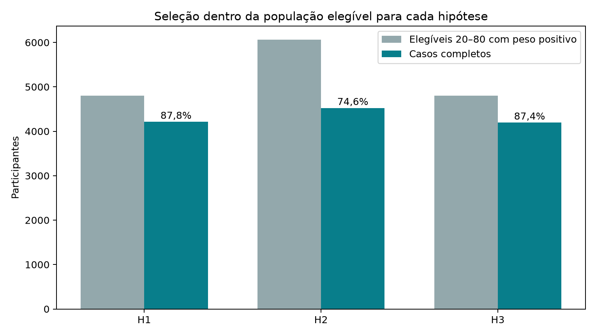
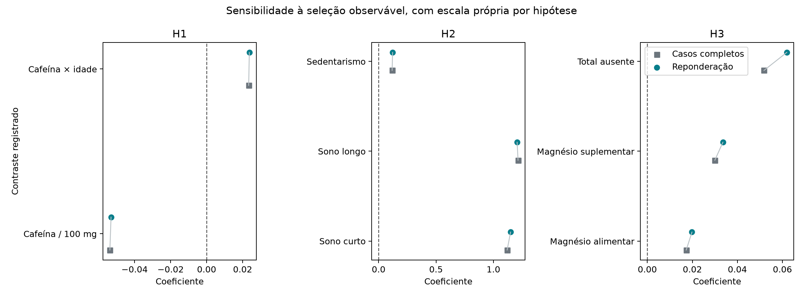

# Resultados do ciclo

<!-- discovery-cycles:start -->
## Inferência e seleção: estabilidade dos resultados sob reponderação

O NCHS sustenta 15 graus do desenho como convenção principal. Reponderar casos completos pela inclusão observável muda H1/H2 em no máximo 3,3%; H3 continua inconclusiva.

População: NHANES 2021–2023, adultos de 20–80 anos elegíveis por hipótese; 4.194–4.522 casos completos, sem identificação de HA/autismo/TDAH.

> Ciclo pós-resultados: fixa 15 graus do desenho como convenção principal segundo o NCHS e testa seleção observável sem alterar os oito contrastes. Não é replicação.

[Métodos, decisões e fontes no site](https://gmrodrigues.github.io/estudo-biohacking-neurodivergente-altas-habilidades/cycles/cycle-004/index.html)

[Registro editorial completo](public-dossier.json)

### Qual convenção de graus usar nos contrastes principais?

15 graus = 30 PSUs − 15 estratos; 1 grau residual preservado como sensibilidade
Decisão metodológica baseada no desenho e documentação; não é estimativa de efeito.
Todos os 30 PSUs e 15 estratos estão representados em H1/H2/H3.

Contrastes individuais usam t com graus do desenho; não se executou busca de termos ou teste conjunto do modelo completo.

### Qual a retenção dentro da população realmente elegível?

H1 87,8%; H2 74,6%; H3 87,4%
Contagens e proporções amostrais; não são taxas populacionais de resposta.
20–80 anos, junções da hipótese, peso positivo e desenho observado.

O denominador de 6.337 do ciclo 002 misturava elegibilidade do componente com incompletude analítica.

### A seleção observável altera os contrastes principais?

H1/H2 mudam no máximo 3,3%; H3 muda até 0,0101 h em valor absoluto e segue inconclusiva
Taylor com propensões tratadas como fixas; seleção não observada não é corrigida.
4.211 em H1, 4.522 em H2 e 4.194 em H3, reponderados pela inclusão observável.

Há estabilidade a esta sensibilidade específica, sem eliminar viés de seleção ou causalidade reversa.



Contagens não ponderadas após restringir a 20–80 anos, peso positivo e desenho observado.



Oito contrastes congelados; linhas conectam a estimativa de casos completos à sensibilidade IPW.

## Limitações

- Propensões usam somente idade, sexo registrado, raça/etnia e estrato.
- A variância trata pesos de resposta estimados como fixos.
- Não recupera exposições/desfechos ausentes nem corrige seleção não observada.
- Mesma onda e participantes dos ciclos anteriores; sem replicação externa.
- Dados transversais não identificam efeitos causais ou individuais.
- HA, autismo e TDAH permanecem not_assessed.

## Fontes

- [CDC/NCHS: variância, subpopulações e graus de liberdade](https://wwwn.cdc.gov/nchs/nhanes/tutorials/varianceestimation.aspx)
- [CDC/NCHS: dicas de software para o desenho NHANES](https://wwwn.cdc.gov/nchs/nhanes/tutorials/softwaretips.aspx)
- [R survey: graus residuais em svyglm](https://r-survey.r-forge.r-project.org/pkgdown/docs/reference/svyglm.html)

## Reprodução

```json
{
  "command": "MPLCONFIGDIR=/tmp/science-matplotlib PIPENV_VENV_IN_PROJECT=1 pipenv run python research/discoveries/cycle-004/run_analysis.py",
  "code_revision": "working tree; run_analysis.py sha256=1727e28af384636a8901bae6fc345fa77f1151f846cb1c6b310310a660471399",
  "input_sha256": {
    "DEMO_L.xpt": "ca4374a158b493b8b0163e1388da21d57a18d1b9cecff2aa4e2fa2bec494fe23",
    "DPQ_L.xpt": "25605a02685035fe997477b31a0991cca2776b0f72f24a8e61ac5b018456304b",
    "DR1TOT_L.xpt": "73a3097aab64000f9c1d138367363ca605968b691e349981132bd6032ca6c9ef",
    "DSQTOT_L.xpt": "8ee3e55578f56918a190100bb321a0b580f824ca3cc439901f2fd707dbe695f8",
    "PAQ_L.xpt": "de34acfed4523f10f52bea06e64ed33c8db973cb38d3539eeceb2b68039248c8",
    "SLQ_L.xpt": "918c3258b2f466ac1cae55ea45330c736dbdc573ee4dc72306e3d2b222764741"
  }
}
```
<!-- discovery-cycles:end -->
